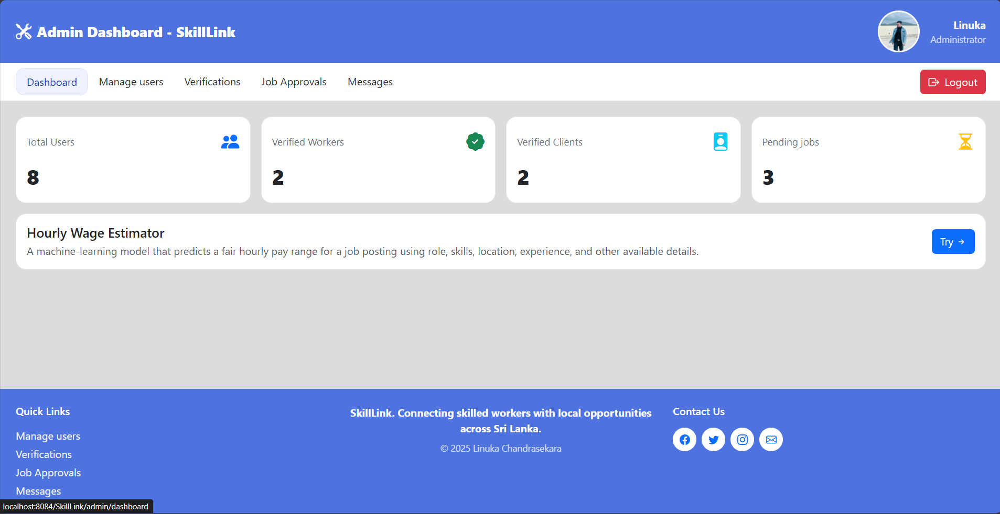
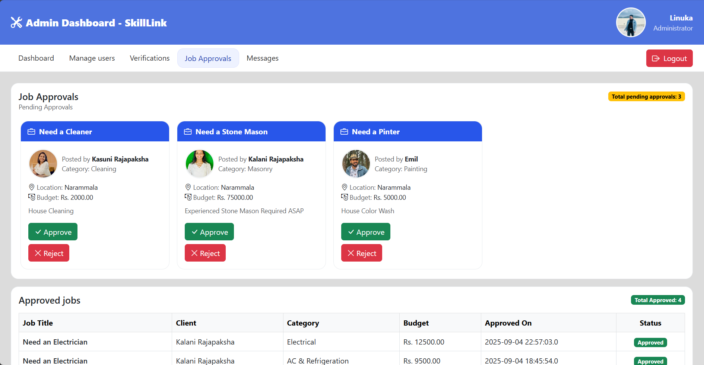
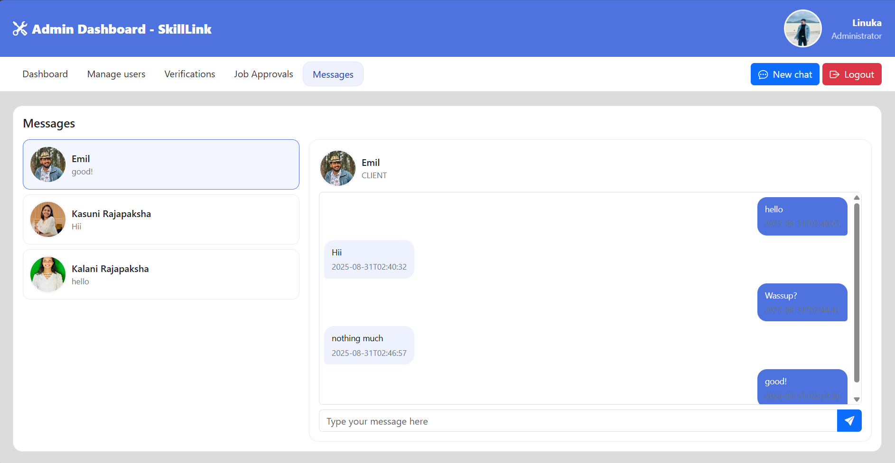
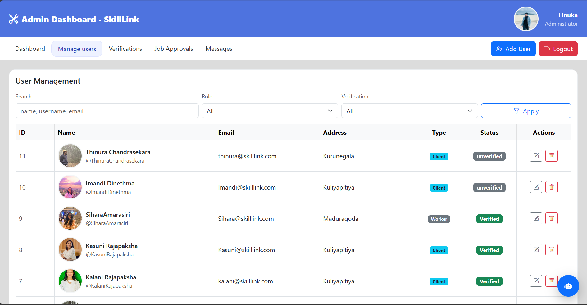
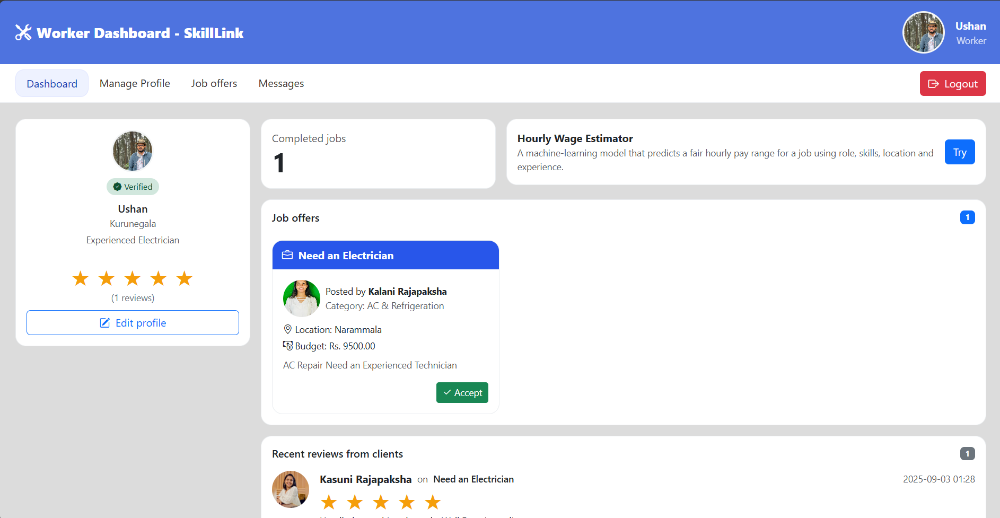
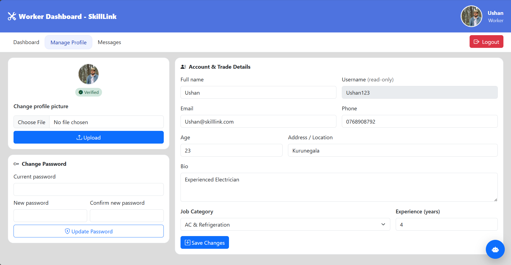
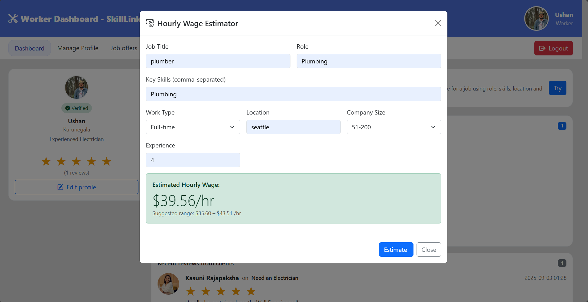

# SkillLink

> A role‑based local services marketplace for Sri Lanka – built with Java (Jakarta Servlet/JSP), JDBC, and Bootstrap 5. Clients post jobs, workers get matched by trade, and everyone can chat, verify, and complete work.

---

## ✨ Highlights

* **Three roles**: Admin, Client, Worker.
* **Jobs & Offers**: Clients post jobs (category, budget, location); workers browse/accept offers; clients close/complete jobs and review.
* **Messaging**: Clean conversation view with unread counts and time stamps.
* **Profiles & Verification**: Media uploads (profile photo, NIC/ID). Status: *Unverified → Pending → Verified/Denied*.
* **Onboarding Assistant**: `/bot/ask` servlet + embeddable `bot-widget.jsp` helps users complete profiles.
* **Modern UI**: Bootstrap 5 + Bootstrap Icons, animated login/register, Terms & Privacy modals.

> **Status**: actively developed for coursework / portfolio use.

---

## 🧱 Tech Stack

* **Backend**: Java 17+, Jakarta Servlet/JSP (Tomcat 10+), JSTL, JDBC.
* **DB**: MySQL/MariaDB (via JDBC).
* **Frontend**: JSP, Bootstrap 5, Bootstrap Icons, a little vanilla JS.
* **Build/Packaging**: Maven (WAR) → Tomcat.

> If you use a different JDK/Tomcat combo, adjust the `jakarta.*` (Servlet 5.0+) dependencies accordingly.

---

## 📁 Project Structure

```
SkillLink/
├─ src/
│  └─ main/
│     ├─ java/
│     │  └─ com/skilllink/
│     │     ├─ controller/
│     │     │  ├─ admin/
│     │     │  ├─ auth/
│     │     │  ├─ bot/
│     │     │  ├─ client/
│     │     │  ├─ common/
│     │     │  ├─ media/
│     │     │  └─ worker/
│     │     ├─ dao/
│     │     │  ├─ dto/
│     │     │  └─ jdbc/
│     │     ├─ filter/
│     │     ├─ model/
│     │     │  ├─ dto/
│     │     │  ├─ enums/
│     │     │  └─ views/
│     │     └─ util/
│     └─ webapp/
│        ├─ fragments/           # reusable JSPs (e.g., bot-widget.jsp)
│        ├─ views/
│        │  ├─ admin/
│        │  ├─ client/
│        │  └─ worker/
│        ├─ WEB-INF/
│        ├─ login.jsp
│        └─ register.jsp
├─ wage-api/                     # optional module (placeholder for wages/matching)
└─ build/                        # IDE/build artifacts
```

---

## 🧭 Core Features (by role)

### Client

* Create/manage job posts (title, description, category, budget, location text).
* Receive/see accepted workers and message them.
* Mark jobs **Closed/Completed** and leave a review.

### Worker

* Manage trade profile (job category, years of experience, bio).
* View admin‑approved job posts relevant to their category.
* Accept offers and message the client.
* Upload profile picture and optional NIC/ID for verification.

### Admin

* Review user verifications (approve/deny).
* Review/approve job posts and moderate content.
* Manage categories and high‑level settings.

### Messaging

* Conversation list with last message preview and unread badge.
* Chat view with "me"/"them" bubbles and timestamps.

### Onboarding Bot

* `POST /bot/ask` (JSON: `{ message, context }`) replies with quick tips for profile fields, verification, picking a category, and writing a bio.
* Include the widget via: `/<context>/fragments/bot-widget.jsp`.

---

## 🔌 Key Routes (non‑exhaustive)

```
/auth/login                /auth/logout
/register-worker           /register-client

/worker/dashboard          /worker/profile
/worker/messages           /worker/messages/send

/client/dashboard          /client/profile
/client/jobs               /client/messages
/client/messages/send

/media/user/profile?userId=123
/bot/ask                   # JSON API used by the Profile Helper
```

---

## 🗄️ Database (high level)

Tables you will typically need:

* `users`, `roles`
* `job_categories`
* `job_posts` (with status: DRAFT/PENDING/APPROVED/CLOSED/COMPLETED)
* `offers` / `accepted_offers`
* `conversations`, `messages`
* `reviews`
* `verifications` (user\_id, status, id\_photo\_path, reviewed\_by, reviewed\_at)

> **Tip**: Keep a `schema.sql` with indexes (user lookups, message threads, job category filters). Add foreign keys with `ON DELETE RESTRICT` for safety.

---

## ⚙️ Configuration

Create a database and user, then set connection details. A simple approach is using environment variables consumed by your `DB` helper:

```properties
# example .env or your app server’s env vars
DB_URL=jdbc:mysql://localhost:3306/skilllink?useSSL=false&serverTimezone=UTC
DB_USER=skilllink
DB_PASSWORD=skilllink
```

If you prefer a `db.properties`, place it on the classpath and load it from `com.skilllink.dao.jdbc.DB`.

---

## 🛠️ Local Development

### Prerequisites

* JDK **17+**
* Maven **3.8+**
* MySQL **8+** (or MariaDB 10.6+)
* Apache Tomcat **10+** (Jakarta Servlet 5)

### 1) Clone

```bash
git clone https://github.com/<you>/SkillLink.git
cd SkillLink
```

### 2) Database

```sql
-- ------------------------------------------------------------
-- SkillLink core schema (MySQL 8+)
-- ------------------------------------------------------------
DROP DATABASE IF EXISTS skilllink;
CREATE DATABASE skilllink
  DEFAULT CHARACTER SET utf8mb4
  DEFAULT COLLATE utf8mb4_0900_ai_ci;
USE skilllink;

-- Ensure strict mode (good defaults in modern MySQL, but set explicitly if needed)
-- SET sql_mode = 'STRICT_TRANS_TABLES,ERROR_FOR_DIVISION_BY_ZERO,NO_ENGINE_SUBSTITUTION';

-- ------------------------------------------------------------
-- Reference tables
-- ------------------------------------------------------------
CREATE TABLE roles (
  role_id       TINYINT UNSIGNED PRIMARY KEY,
  role_name     VARCHAR(32) NOT NULL UNIQUE
) ENGINE=InnoDB;

INSERT INTO roles (role_id, role_name) VALUES
 (1,'admin'), (2,'worker'), (3,'client');

CREATE TABLE job_categories (
  job_category_id  INT UNSIGNED PRIMARY KEY AUTO_INCREMENT,
  name             VARCHAR(100) NOT NULL UNIQUE,
  description      VARCHAR(255) NULL
) ENGINE=InnoDB;

INSERT INTO job_categories (name, description) VALUES
 ('Plumbing','Pipes, leaks, installations'),
 ('Electrical','Wiring, panels, fixtures'),
 ('Carpentry','Woodwork, framing, furniture'),
 ('Cleaning','Home & office cleaning'),
 ('Painting','Interior & exterior'),
 ('AC & Refrigeration','Cooling systems'),
 ('Masonry','Bricks, cement, tiles');

-- ------------------------------------------------------------
-- Users & role extensions
-- ------------------------------------------------------------
CREATE TABLE users (
  user_id          BIGINT UNSIGNED PRIMARY KEY AUTO_INCREMENT,
  role_id          TINYINT UNSIGNED NOT NULL,
  full_name        VARCHAR(150) NOT NULL,
  nid              VARCHAR(50)  NOT NULL,                      -- National ID as provided
  phone            VARCHAR(30)  NOT NULL,
  email            VARCHAR(160) NOT NULL,
  age              TINYINT UNSIGNED NOT NULL,
  address_line     VARCHAR(255) NOT NULL,                      -- Address / Location
  username         VARCHAR(60)  NOT NULL,
  password_hash    VARCHAR(255) NOT NULL,                      -- Store a hash, never plaintext
  bio              TEXT NULL,
  profile_picture  LONGBLOB NULL,                              -- BLOB for profile picture
  verification_status ENUM('unverified','pending','verified','denied') NOT NULL DEFAULT 'unverified',
  is_active        BOOLEAN NOT NULL DEFAULT TRUE,
  created_at       TIMESTAMP NOT NULL DEFAULT CURRENT_TIMESTAMP,
  updated_at       TIMESTAMP NOT NULL DEFAULT CURRENT_TIMESTAMP ON UPDATE CURRENT_TIMESTAMP,
  CONSTRAINT fk_users_role FOREIGN KEY (role_id) REFERENCES roles(role_id),
  CONSTRAINT uq_users_email UNIQUE (email),
  CONSTRAINT uq_users_username UNIQUE (username),
  INDEX idx_users_role (role_id),
  INDEX idx_users_verif (verification_status),
  INDEX idx_users_email (email)
) ENGINE=InnoDB;

-- Client extension (only clients choose individual/business)
CREATE TABLE clients (
  user_id          BIGINT UNSIGNED PRIMARY KEY,
  client_type      ENUM('individual','business') NOT NULL,
  CONSTRAINT fk_clients_user FOREIGN KEY (user_id) REFERENCES users(user_id)
    ON DELETE CASCADE
) ENGINE=InnoDB;

-- Worker extension
CREATE TABLE workers (
  user_id          BIGINT UNSIGNED PRIMARY KEY,
  job_category_id  INT UNSIGNED NOT NULL,
  experience_years SMALLINT UNSIGNED NOT NULL DEFAULT 0,       -- "experience"
  CONSTRAINT fk_workers_user FOREIGN KEY (user_id) REFERENCES users(user_id)
    ON DELETE CASCADE,
  CONSTRAINT fk_workers_category FOREIGN KEY (job_category_id) REFERENCES job_categories(job_category_id)
) ENGINE=InnoDB;

-- Admin extension (role is 'individual' by default)
CREATE TABLE admins (
  user_id          BIGINT UNSIGNED PRIMARY KEY,
  CONSTRAINT fk_admins_user FOREIGN KEY (user_id) REFERENCES users(user_id)
    ON DELETE CASCADE
) ENGINE=InnoDB;

-- ------------------------------------------------------------
-- Verification workflow (ID uploads + audit trail)
-- ------------------------------------------------------------
CREATE TABLE verification_submissions (
  submission_id    BIGINT UNSIGNED PRIMARY KEY AUTO_INCREMENT,
  user_id          BIGINT UNSIGNED NOT NULL,
  id_photo         LONGBLOB NOT NULL,                          -- The uploaded ID image
  status           ENUM('pending','approved','denied') NOT NULL DEFAULT 'pending',
  reviewer_admin_id BIGINT UNSIGNED NULL,                      -- Admin who reviewed
  reviewer_notes   VARCHAR(255) NULL,
  created_at       TIMESTAMP NOT NULL DEFAULT CURRENT_TIMESTAMP,
  decided_at       TIMESTAMP NULL DEFAULT NULL,
  CONSTRAINT fk_vs_user FOREIGN KEY (user_id) REFERENCES users(user_id)
    ON DELETE CASCADE,
  CONSTRAINT fk_vs_admin FOREIGN KEY (reviewer_admin_id) REFERENCES admins(user_id)
    ON DELETE SET NULL,
  INDEX idx_vs_user (user_id, status),
  INDEX idx_vs_status (status),
  INDEX idx_vs_created (created_at)
) ENGINE=InnoDB;

-- (Optional) Helper trigger: keep users.verification_status in sync with last decision
DELIMITER $$
CREATE TRIGGER trg_verification_submissions_after_update
AFTER UPDATE ON verification_submissions
FOR EACH ROW
BEGIN
  IF NEW.status IN ('approved','denied') THEN
    UPDATE users
      SET verification_status = (CASE NEW.status
                                   WHEN 'approved' THEN 'verified'
                                   WHEN 'denied' THEN 'denied'
                                 END)
    WHERE users.user_id = NEW.user_id;
  END IF;
END$$
DELIMITER ;

-- ------------------------------------------------------------
-- Job posts (Client -> Admin review -> visible to Workers)
-- ------------------------------------------------------------
CREATE TABLE job_posts (
  job_id           BIGINT UNSIGNED PRIMARY KEY AUTO_INCREMENT,
  client_id        BIGINT UNSIGNED NOT NULL,                   -- references clients.user_id
  job_category_id  INT UNSIGNED NOT NULL,
  title            VARCHAR(150) NOT NULL,
  description      TEXT NOT NULL,
  budget_amount    DECIMAL(10,2) NOT NULL,
  location_text    VARCHAR(255) NULL,                          -- optional job location
  status           ENUM('pending','approved','denied','closed','completed') NOT NULL DEFAULT 'pending',
  reviewer_admin_id BIGINT UNSIGNED NULL,
  reviewed_at      TIMESTAMP NULL,
  created_at       TIMESTAMP NOT NULL DEFAULT CURRENT_TIMESTAMP,
  updated_at       TIMESTAMP NOT NULL DEFAULT CURRENT_TIMESTAMP ON UPDATE CURRENT_TIMESTAMP,
  CONSTRAINT fk_jobs_client FOREIGN KEY (client_id) REFERENCES clients(user_id)
    ON DELETE CASCADE,
  CONSTRAINT fk_jobs_category FOREIGN KEY (job_category_id) REFERENCES job_categories(job_category_id),
  CONSTRAINT fk_jobs_admin FOREIGN KEY (reviewer_admin_id) REFERENCES admins(user_id)
    ON DELETE SET NULL,
  INDEX idx_jobs_status (status),
  INDEX idx_jobs_category (job_category_id),
  INDEX idx_jobs_client_status (client_id, status),
  FULLTEXT INDEX ftx_jobs (title, description)
) ENGINE=InnoDB;

-- ------------------------------------------------------------
-- Messaging (supports Client↔Worker, Admin↔Client, Admin↔Worker, and job-bound threads)
-- ------------------------------------------------------------
CREATE TABLE conversations (
  conversation_id  BIGINT UNSIGNED PRIMARY KEY AUTO_INCREMENT,
  created_by       BIGINT UNSIGNED NOT NULL,                   -- user who started the conversation
  job_id           BIGINT UNSIGNED NULL,                       -- optional: link a conversation to a job
  is_group         BOOLEAN NOT NULL DEFAULT FALSE,
  created_at       TIMESTAMP NOT NULL DEFAULT CURRENT_TIMESTAMP,
  CONSTRAINT fk_conv_creator FOREIGN KEY (created_by) REFERENCES users(user_id)
    ON DELETE CASCADE,
  CONSTRAINT fk_conv_job FOREIGN KEY (job_id) REFERENCES job_posts(job_id)
    ON DELETE SET NULL,
  INDEX idx_conversations_job (job_id)
) ENGINE=InnoDB;

CREATE TABLE conversation_participants (
  conversation_id  BIGINT UNSIGNED NOT NULL,
  user_id          BIGINT UNSIGNED NOT NULL,
  joined_at        TIMESTAMP NOT NULL DEFAULT CURRENT_TIMESTAMP,
  PRIMARY KEY (conversation_id, user_id),
  CONSTRAINT fk_cp_conv FOREIGN KEY (conversation_id) REFERENCES conversations(conversation_id)
    ON DELETE CASCADE,
  CONSTRAINT fk_cp_user FOREIGN KEY (user_id) REFERENCES users(user_id)
    ON DELETE CASCADE,
  INDEX idx_cp_user (user_id)
) ENGINE=InnoDB;

CREATE TABLE messages (
  message_id       BIGINT UNSIGNED PRIMARY KEY AUTO_INCREMENT,
  conversation_id  BIGINT UNSIGNED NOT NULL,
  sender_id        BIGINT UNSIGNED NOT NULL,
  body             TEXT NOT NULL,
  attachment_blob  LONGBLOB NULL,                              -- optional file/image
  created_at       TIMESTAMP NOT NULL DEFAULT CURRENT_TIMESTAMP,
  is_read          BOOLEAN NOT NULL DEFAULT FALSE,
  CONSTRAINT fk_msg_conv FOREIGN KEY (conversation_id) REFERENCES conversations(conversation_id)
    ON DELETE CASCADE,
  CONSTRAINT fk_msg_sender FOREIGN KEY (sender_id) REFERENCES users(user_id)
    ON DELETE CASCADE,
  INDEX idx_messages_conv_time (conversation_id, created_at),
  INDEX idx_messages_sender (sender_id)
) ENGINE=InnoDB;

-- ------------------------------------------------------------
-- Reviews (Client reviews Worker after job completion)
-- ------------------------------------------------------------
CREATE TABLE reviews (
  review_id        BIGINT UNSIGNED PRIMARY KEY AUTO_INCREMENT,
  job_id           BIGINT UNSIGNED NOT NULL,
  client_id        BIGINT UNSIGNED NOT NULL,
  worker_id        BIGINT UNSIGNED NOT NULL,
  rating           TINYINT UNSIGNED NOT NULL,                  -- 1..5
  comment          VARCHAR(500) NULL,
  created_at       TIMESTAMP NOT NULL DEFAULT CURRENT_TIMESTAMP,
  CONSTRAINT chk_reviews_rating CHECK (rating BETWEEN 1 AND 5),
  CONSTRAINT fk_reviews_job FOREIGN KEY (job_id) REFERENCES job_posts(job_id)
    ON DELETE CASCADE,
  CONSTRAINT fk_reviews_client FOREIGN KEY (client_id) REFERENCES clients(user_id)
    ON DELETE CASCADE,
  CONSTRAINT fk_reviews_worker FOREIGN KEY (worker_id) REFERENCES workers(user_id)
    ON DELETE CASCADE,
  UNIQUE KEY uq_reviews_job_client (job_id, client_id),        -- one review per job from that client
  INDEX idx_reviews_worker (worker_id),
  INDEX idx_reviews_job (job_id)
) ENGINE=InnoDB;

-- ------------------------------------------------------------
-- Helpful views for the UI
-- ------------------------------------------------------------

-- Jobs visible to workers (only approved)
CREATE OR REPLACE VIEW v_approved_jobs AS
SELECT
  j.job_id, j.title, j.description, j.budget_amount, j.location_text,
  j.job_category_id, c.name AS job_category_name,
  j.client_id, u.full_name AS client_name, j.status, j.created_at
FROM job_posts j
JOIN job_categories c ON c.job_category_id = j.job_category_id
JOIN users u ON u.user_id = j.client_id
WHERE j.status = 'approved';

-- Worker rating summary
CREATE OR REPLACE VIEW v_worker_rating_summary AS
SELECT
  w.user_id AS worker_id,
  u.full_name,
  AVG(r.rating) AS avg_rating,
  COUNT(r.review_id) AS total_reviews
FROM workers w
JOIN users u ON u.user_id = w.user_id
LEFT JOIN reviews r ON r.worker_id = w.user_id
GROUP BY w.user_id, u.full_name;

-- Simple profile view joining role extensions
CREATE OR REPLACE VIEW v_user_profiles AS
SELECT
  u.user_id, u.full_name, u.role_id, r.role_name,
  u.email, u.phone, u.address_line, u.bio, u.verification_status,
  w.job_category_id, jc.name AS worker_job_category, w.experience_years,
  c.client_type
FROM users u
JOIN roles r ON r.role_id = u.role_id
LEFT JOIN workers w ON w.user_id = u.user_id
LEFT JOIN job_categories jc ON jc.job_category_id = w.job_category_id
LEFT JOIN clients c ON c.user_id = u.user_id;

-- ------------------------------------------------------------
-- Sample indexes for common wireframe actions
-- (already placed above; kept here as a reminder)
--   - Messages by conversation/time: idx_messages_conv_time
--   - Jobs by status: idx_jobs_status
--   - Jobs by category for worker filtering: idx_jobs_category
--   - Users by verification status for admin dashboard: idx_users_verif
-- ------------------------------------------------------------

CREATE TABLE IF NOT EXISTS job_assignments (
  job_id     BIGINT UNSIGNED NOT NULL,
  worker_id  BIGINT UNSIGNED NOT NULL,
  status     ENUM('accepted','in_progress','completed','cancelled') NOT NULL DEFAULT 'accepted',
  assigned_at TIMESTAMP NOT NULL DEFAULT CURRENT_TIMESTAMP,
  PRIMARY KEY (job_id),                       -- one worker per job
  KEY idx_ja_worker (worker_id),
  CONSTRAINT fk_ja_job    FOREIGN KEY (job_id) REFERENCES job_posts(job_id)  ON DELETE CASCADE,
  CONSTRAINT fk_ja_worker FOREIGN KEY (worker_id) REFERENCES workers(user_id) ON DELETE CASCADE
);

```

> Import your `schema.sql` and any seed data (admin user, categories).

### 3) Build

```bash
mvn clean package
```

This produces `target/SkillLink.war`.

### 4) Run (Tomcat)

* Drop the WAR into Tomcat’s `webapps/` folder **or** configure from your IDE.
* Visit: `http://localhost:8080/SkillLink`

---

## 🧪 Smoke Test

1. **Register** a Worker and a Client.
2. **Login** (each role) and update profiles.
3. As **Client**, create a job post.
4. As **Admin**, approve the job post (and verify worker if needed).
5. As **Worker**, accept the job offer.
6. **Message** between client ↔ worker.
7. **Close/Complete** the job and leave a **review**.

---

## 🤖 Bot API (dev notes)

* Endpoint: `POST /bot/ask`
* Request:

```json
{
  "message": "How do I get verified?",
  "context": {
    "page": "register",
    "roleHint": "worker-pane",
    "age": "28",
    "experience_years": "3"
  }
}
```

* Response:

```json
{ "reply": "To get verified, upload a clear NIC/ID photo. Your status becomes Pending until an admin reviews it." }
```

> The provided `LLMProvider` is a stub. Swap in a real provider when ready and keep API keys server‑side only.

---

## 📸 Screenshots

<table>
  <tr>
    <td></td>
    <td></td>
    <td></td>
  </tr>
  <tr>
    <td></td>
    <td></td>
    <td></td>
  </tr>
  <tr>
    <td colspan="3" align="center">
      
    </td>
  </tr>
</table>

---

## 🤝 Contributing

1. Fork this repo
2. Create a feature branch (git checkout -b feature-name)
3. Commit changes (git commit -m 'Add new feature')
4. Push branch (git push origin feature-name)
5. Open Pull Request

---

## 🔐 Security & Privacy

* Never log PII or raw passwords.
* Hash passwords with a strong algorithm (e.g., BCrypt/Argon2) and salt.
* Validate & sanitize all inputs; use prepared statements everywhere.
* Show the **Terms of Service** and **Privacy Policy** modals on login/register.

---

## 📜 License

> **Unlicensed for now** – you may use/modify locally. 


### Maintainers

* Linuka (https://github.com/LinukaChandrasekara) — creator/maintainer
